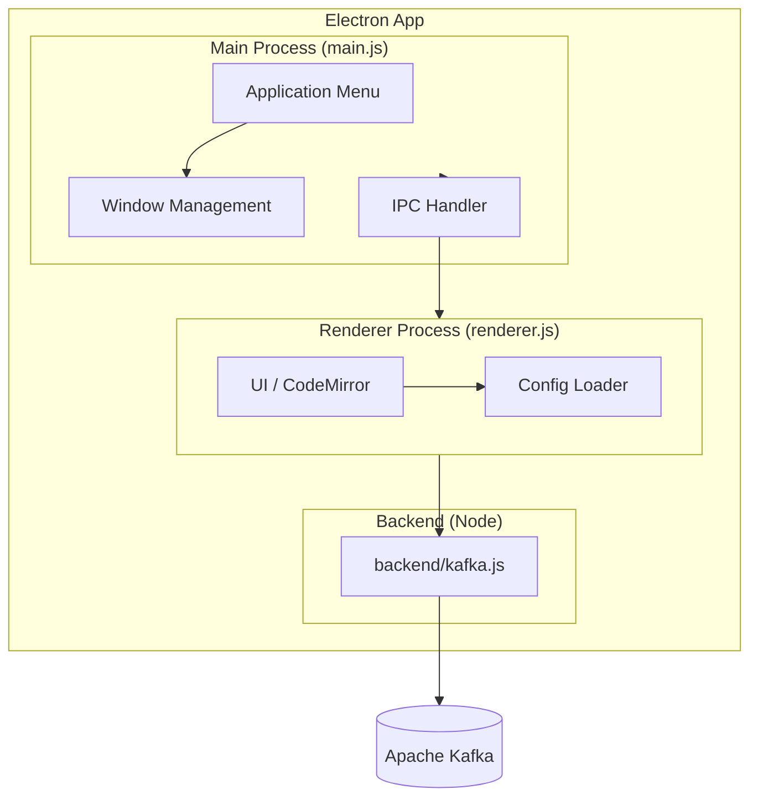
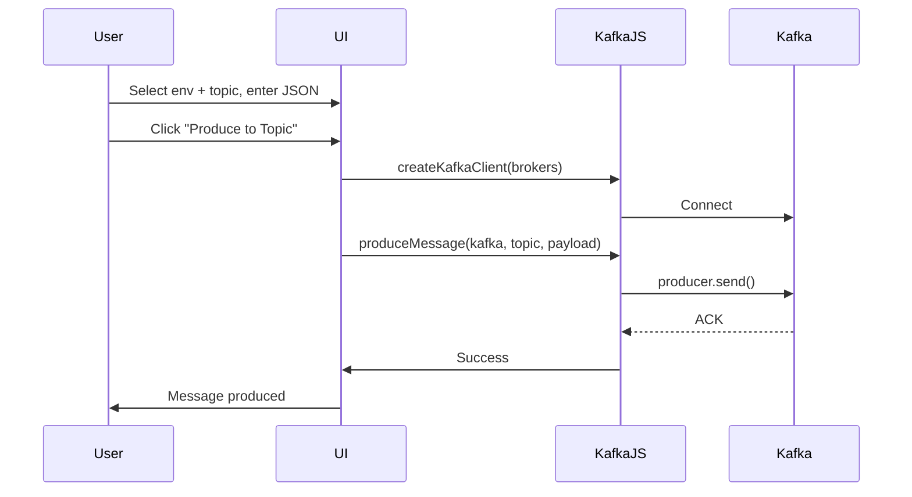
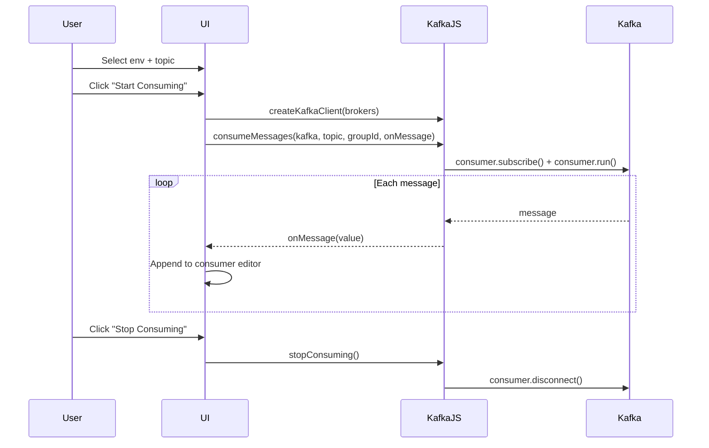
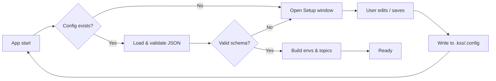

# Kafka Safe Stream

<p align="center">
  <strong>A lightweight desktop Kafka UI for producing and consuming messages</strong>
</p>

<p align="center">
  <a href="https://github.com/DilshanPGN/kafka-safe-stream/releases"></a>
  <a href="https://github.com/DilshanPGN/kafka-safe-stream/blob/main/package.json"></a>
  <a href="https://github.com/DilshanPGN/kafka-safe-stream/issues"></a>
</p>

---

## Overview

**Kafka Safe Stream (KSS)** is a minimal, cross-platform desktop application built with Electron that lets you send and receive messages from Apache Kafka topics. It supports multiple environments (e.g. DEV, QA, PROD) and provides a simple JSON editor for producing messages and a live consumer view.

> **Note:** Currently tested on **Windows**. Check [Releases](https://github.com/DilshanPGN/kafka-safe-stream/releases) for the latest builds.

---

## Features

| Feature | Description |
|--------|-------------|
| **Multi-environment** | Switch between configured environments (DEV, QA, etc.) from the sidebar |
| **Producer** | Write JSON payloads and produce messages to selected topics |
| **Consumer** | Subscribe to topics and stream messages in real time with start/stop control |
| **JSON editor** | CodeMirror-based editor with syntax highlighting (Dracula theme), line numbers, and format |
| **Config validation** | Schema-validated configuration via **File → Setup** or manual `.config` file |
| **Portable build** | Optional portable Windows executable (no install required) |

---

## Architecture

### High-level architecture



### Producer flow



### Consumer flow



### Configuration flow



---

## Prerequisites

- **Node.js** (LTS recommended)
- **Apache Kafka** cluster with at least one broker reachable from your machine
- **npm** or **yarn**

---

## Installation

### From source

```bash
git clone https://github.com/DilshanPGN/kafka-safe-stream.git
cd kafka-safe-stream
npm install
npm start
```

### From release (Windows)

1. Go to [Releases](https://github.com/DilshanPGN/kafka-safe-stream/releases).
2. Download the latest installer or portable executable.
3. Run the installer, or extract and run the portable `.exe`.

---

## Configuration

Configuration is stored in a single JSON file. The app will prompt you to set it up if the file is missing or invalid.

### Config location

| OS      | Path |
|---------|------|
| Windows | `%USERPROFILE%\.kss\.config` |
| Linux/macOS | `~/.kss/.config` |

You can also open **File → Setup** from the menu to edit the config in the app; the Setup window shows the config path and validates on save.

### Config schema

Each **key** is an environment id (e.g. `dev`, `qa`). Each **value** must have:

| Field       | Type     | Required | Description |
|------------|----------|----------|-------------|
| `id`       | string   | Yes      | Unique environment id (e.g. `dev`) |
| `label`    | string   | Yes      | Display name in the sidebar (e.g. `DEV`, `QA`) |
| `brokers`  | string[] | Yes      | Kafka broker addresses (e.g. `host:9092`) |
| `topicList`| string[] | Yes      | Topic names available in this environment |

Environment keys must match: `^[a-zA-Z0-9_-]+$`.

### Example configuration

```json
{
    "dev": {
        "id": "dev",
        "label": "DEV",
        "brokers": ["dev-host1:9092", "dev-host2:9092"],
        "topicList": [
            "test.topic",
            "orders.v1"
        ]
    },
    "qa": {
        "id": "qa",
        "label": "QA",
        "brokers": ["qa-host1:9092", "qa-host2:9092"],
        "topicList": [
            "topic-abc",
            "kafka-demo-topic"
        ]
    }
}
```

---

## Usage

1. **Configure**  
   On first run, or if config is missing/invalid, the Setup window opens. Add at least one environment with brokers and topic list, then save.

2. **Select environment**  
   Click an environment in the left sidebar (e.g. DEV, QA). The topic list for that environment appears.

3. **Producer**  
   - Select a topic from the list.  
   - In the payload editor, enter valid JSON.  
   - Use **Format** to pretty-print.  
   - Click **Produce to Topic** to send the message.

4. **Consumer**  
   - Switch to the **Consumer** tab.  
   - Select a topic.  
   - Click **Start Consuming** to subscribe (from beginning). Messages append in the consumer editor.  
   - Click **Stop Consuming** to disconnect.  
   - Use **Clear** to clear the consumer view.

5. **Menu**  
   - **File → Setup**: Open configuration editor.  
   - **File → Quit**: Exit (Ctrl+Q on Windows/Linux, Cmd+Q on macOS).  
   - **Help → About**: App version and credits.

---

## Project structure

```
kafka-safe-stream/
├── main.js              # Electron main process, menu, windows
├── index.html            # Main window UI
├── renderer.js           # Main window logic, config, producer/consumer UI
├── styles.css            # Main window styles
├── setup.html / setup.js / setup.css   # Setup window
├── about.html / about.css              # About window
├── schema.json           # JSON schema for .config validation
├── backend/
│   └── kafka.js          # KafkaJS client: produce, consume, disconnect
├── codemirror/           # CodeMirror assets (editor)
├── package.json
├── forge.config.js       # Electron Forge packaging (Squirrel, ZIP, deb, rpm, portable)
└── README.md
```

---

## Tech stack

| Layer        | Technology |
|-------------|------------|
| Desktop     | Electron 34 |
| Kafka client| KafkaJS 2.x |
| Validation  | AJV (JSON schema) |
| Editor      | CodeMirror (Dracula theme) |
| Packaging   | Electron Forge (Squirrel, ZIP, deb, rpm, portable) |

---

## Building and packaging

```bash
# Run in development (with electronmon)
npm start

# Package the app (output in out/)
npm run package

# Create installers / distributables
npm run make
```

Build artifacts (e.g. Windows Squirrel installer, portable exe, macOS ZIP, deb/rpm) are produced according to `forge.config.js`.

---

## Contributing

1. Fork the repository.
2. Create a branch, make your changes, and ensure the app runs with `npm start`.
3. Open a pull request with a clear description of the change.

---

## Developers

- [DilshanPGN](https://github.com/DilshanPGN)
- [uabeykoon](https://github.com/uabeykoon)
- [skaveesh](https://github.com/skaveesh)

---

## License

ISC © DilshanPGN, uabeykoon, skaveesh

---

## Links

- **Releases:** [github.com/DilshanPGN/kafka-safe-stream/releases](https://github.com/DilshanPGN/kafka-safe-stream/releases)
- **Issues:** [github.com/DilshanPGN/kafka-safe-stream/issues](https://github.com/DilshanPGN/kafka-safe-stream/issues)
