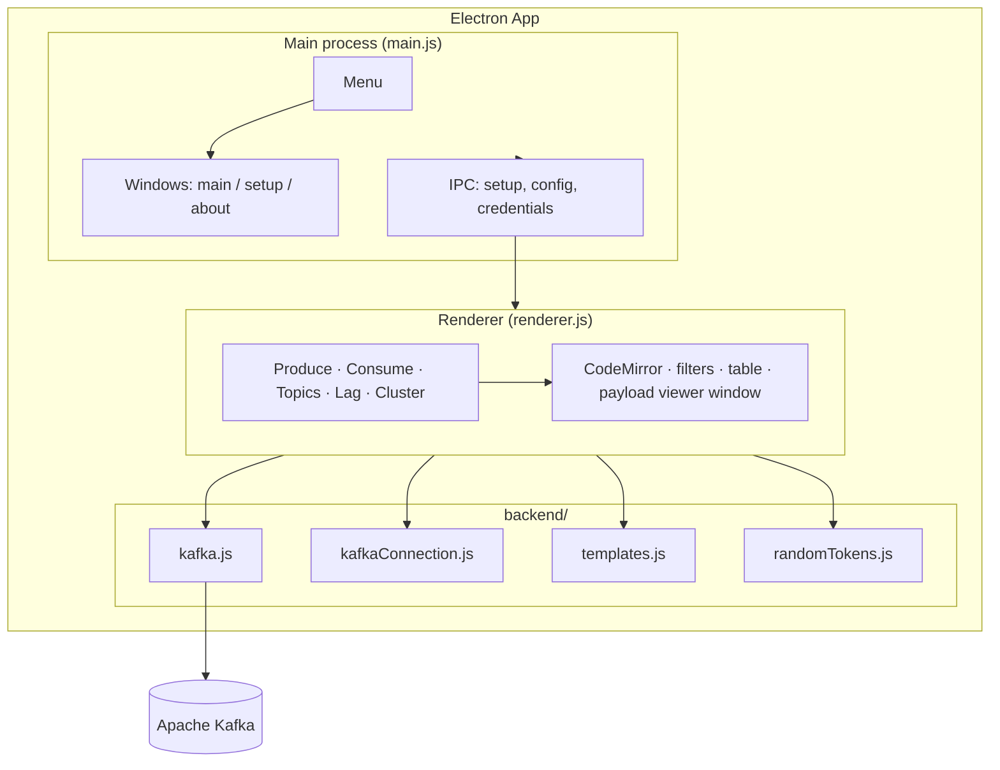
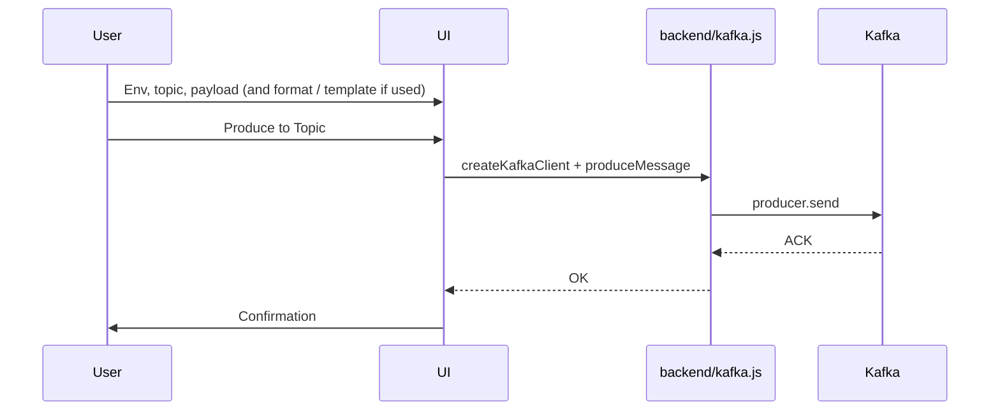
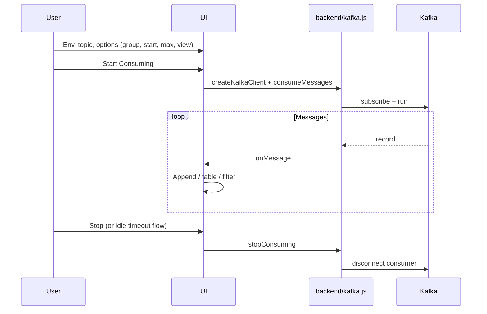
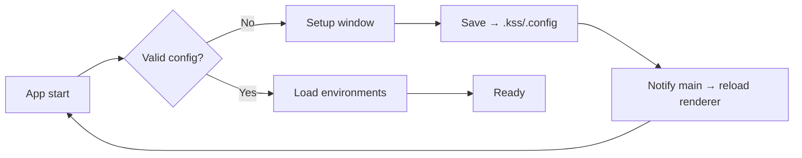

# Kafka Safe Stream

<p align="center">
  <strong>A lightweight desktop Kafka UI for producing and consuming messages</strong>
</p>

<p align="center">
  <a href="https://github.com/DilshanPGN/kafka-safe-stream/releases"></a>
  <a href="https://github.com/DilshanPGN/kafka-safe-stream/blob/main/package.json"></a>
  <a href="https://github.com/DilshanPGN/kafka-safe-stream/issues"></a>
</p>

---

## Overview

**Kafka Safe Stream (KSS)** is a cross-platform desktop app built with Electron. You pick an environment and topic, produce payloads, consume in real time, and inspect the cluster (topic list, consumer-group lag, broker and partition health). **Basic** mode hides advanced consumer and ops UI; **Advanced** exposes full controls.

> **Note:** Primarily exercised on **Windows**. See [Releases](https://github.com/DilshanPGN/kafka-safe-stream/releases) for builds.

---

## Features

| Feature | Description |
|--------|-------------|
| **Environments** | Per-env brokers, topics, and TLS/SASL settings; switch from the top bar |
| **Tabs** | **Produce**, **Consume**, **Topics**, **Consumer lag**, **Cluster** (sidebar) |
| **Producer** | JSON, XML, or plain text; format button; optional **templates** and **random token** inserts |
| **Consumer** | Start/stop, filters (plain or regex), optional **table view** with metadata, **export** (JSON / JSONL / CSV), **view payload** in a separate window |
| **Consumer options** | Group id, start from (beginning / latest / partition+offset), max messages; **background idle** prompt to avoid leaving a consumer running unnoticed |
| **Topics browser** | List topics from the cluster (beyond the configured `topicList`) |
| **Consumer lag** | Per-group lag for a chosen topic; optional **offset reset to latest** and **delete group** when `allowedUnsafeOperations` is enabled in config |
| **Cluster** | Cluster id, brokers, controller, topic/partition health summary |
| **Editor** | CodeMirror with syntax modes per format |
| **Theme** | Light / dark (persisted); Setup window follows theme from the main app |
| **Config** | Schema-validated **File → Setup** or `~/.kss/.config`; credentials via overlay + optional **Remember** (OS-backed encryption when available) |
| **Portable build** | Optional portable Windows executable (no install) |

---

## Architecture

### High-level architecture



### Producer flow



### Consumer flow



### Configuration flow



---

## Prerequisites

- **Node.js** (LTS recommended)
- **Apache Kafka** reachable from your machine
- **npm** or **yarn**

---

## Installation

### From source

```bash
git clone https://github.com/DilshanPGN/kafka-safe-stream.git
cd kafka-safe-stream
npm install
npm start
```

### From release (Windows)

1. Open [Releases](https://github.com/DilshanPGN/kafka-safe-stream/releases).
2. Download the installer or portable executable.
3. Run the installer, or run the portable `.exe`.

---

## Configuration

Stored as one JSON object. Missing or invalid config opens **Setup**.

### Config location

| OS | Path |
|----|------|
| Windows | `%USERPROFILE%\.kss\.config` |
| Linux/macOS | `~/.kss/.config` |

**File → Setup** shows the path and validates on save.

### Environment object (per key)

| Field | Required | Notes |
|-------|----------|--------|
| `id`, `label`, `brokers`, `topicList` | Yes | Key must match `^[a-zA-Z0-9_-]+$` |
| `connection` | No | TLS / SASL (same protocols and mechanisms as before) |
| `allowedUnsafeOperations` | No | If `true`, enables consumer-group **offset reset** and **delete group** in the Consumer lag tab (config JSON only, not the simple Setup form) |

Secrets (passwords, OAuth token, AWS secret key, TLS key passphrase) are **not** in `.config`. Enter when prompted or in Setup probe; **Remember** stores under `~/.kss/credentials.store.json` with **safeStorage** when the OS supports it. **SASL/GSSAPI (Kerberos)** is not supported the same way as the Java client.

### Example

```json
{
  "dev": {
    "id": "dev",
    "label": "DEV",
    "brokers": ["localhost:9092"],
    "topicList": ["demo.events"],
    "connection": {
      "securityProtocol": "SASL_SSL",
      "saslMechanism": "scram-sha-256",
      "username": "app",
      "rejectUnauthorized": true
    }
  }
}
```

---

## Usage

1. **First run** — Complete **Setup** (or place a valid `.config` under `~/.kss/`).
2. **Environment** — Choose env in the **top bar**; topics come from config (and you can browse more on the **Topics** tab).
3. **Produce** — Open **Produce**, pick topic and **format**, edit payload, **Format** if needed, then **Produce to Topic**. Optional: **Templates** (save/load/update) and **Insert token** for placeholders.
4. **Consume** — **Consume** tab: filters, optional **table view**, **Export**, **Start** / **Stop**. In **Advanced**, set consumer group, **Start from**, partition/offset, and max messages.
5. **Inspect** — **Topics** (list), **Consumer lag** (groups on a topic), **Cluster** (brokers + health). Dangerous lag actions require `allowedUnsafeOperations`.
6. **Menu** — **File → Setup**, **File → Quit**, **Help → About**.

---

## Project structure

```
kafka-safe-stream/
├── main.js                 # Main process, menu, windows, IPC
├── index.html              # Main shell
├── renderer.js             # UI, tabs, producer/consumer/inspector
├── styles.css
├── setup.html / setup.js / setup.css
├── about.html / about.css
├── payload-viewer.html / payload-viewer.js   # Detached payload window
├── schema.json
├── backend/
│   ├── kafka.js            # KafkaJS: produce, consume, admin, lag
│   ├── kafkaConnection.js
│   ├── templates.js        # Saved producer templates
│   └── randomTokens.js     # Token expansion for templates
├── codemirror/
├── package.json
├── forge.config.js
└── README.md
```

---

## Tech stack

| Layer | Technology |
|-------|------------|
| Desktop | Electron 41 |
| Kafka | KafkaJS 2.x |
| Validation | AJV + `schema.json` |
| Editor | CodeMirror (JSON / XML modes) |
| Test data tokens | @faker-js/faker (via `randomTokens`) |
| Packaging | Electron Forge (Squirrel, ZIP, deb, rpm, portable) |

---

## Building and packaging

```bash
npm start          # dev (electronmon)
npm run package    # output under out/
npm run make       # installers / distributables (see forge.config.js)
```

---

## Contributing

1. Fork the repository.
2. Branch, change, verify with `npm start`.
3. Open a PR with a short, clear description.

---

## Developers

- [DilshanPGN](https://github.com/DilshanPGN)
- [uabeykoon](https://github.com/uabeykoon)
- [skaveesh](https://github.com/skaveesh)
- [chiran-wijesekara](https://github.com/chiran-wijesekara)

---

## License

ISC © DilshanPGN, uabeykoon, skaveesh, chiran-wijesekara

---

## Links

- **Releases:** [github.com/DilshanPGN/kafka-safe-stream/releases](https://github.com/DilshanPGN/kafka-safe-stream/releases)
- **Issues:** [github.com/DilshanPGN/kafka-safe-stream/issues](https://github.com/DilshanPGN/kafka-safe-stream/issues)
